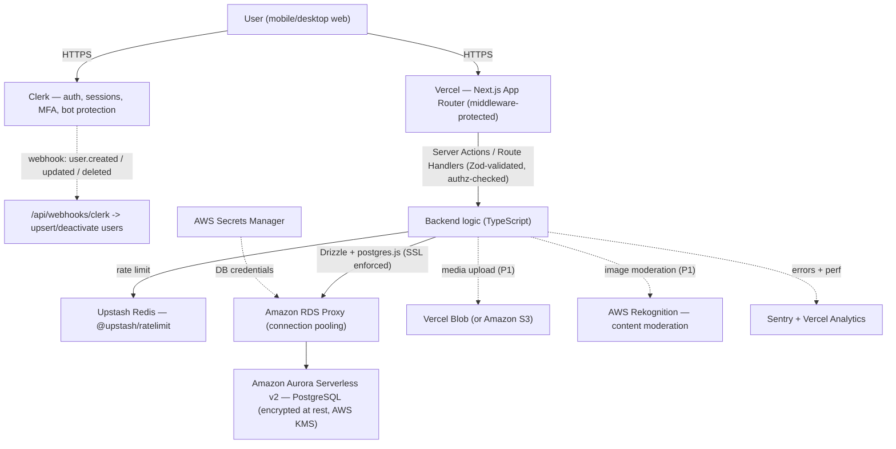

# MemoryMatch — Product Requirements Document (Hackathon MVP)

**Version:** 1.1 · **Date:** June 5, 2026 · **Team:** Calvin, Karlee, Emily
**Event:** H01 Hackathon by Vercel & AWS · **Track:** Track 1 — Monetizable B2C
**Submission deadline:** June 29, 2026, 8:00 PM EDT (Devpost)
**Changelog (1.1):** Real authentication is now in scope (Clerk). The whole build target is reframed from "shippable demo" to **production-grade foundations**: real authorization on every mutation, functional safety (18+ gate, block, report), privacy-by-design data model with account deletion, observability, tests on critical paths, and CI/CD. Six new engineering sections added (§31–§36). AWS footprint deepened (Aurora + RDS Proxy + Secrets Manager + KMS + optional Rekognition) to strengthen the competitive narrative.

---

## Production-Readiness Philosophy (read first)

We are building **production-track, not a throwaway demo.** In a competitive Vercel + AWS hackathon, a clean idea with a real, secure, well-architected foundation beats a flashy prototype that falls apart under a judge's first poke.

**What "production-grade" means for us — and what it does not:**

- It **does** mean: real auth, server-enforced authorization on every write, enforced Trust & Safety controls (age gate, block, report), encryption in transit and at rest, secrets handled properly, input validation at every boundary, observability (errors + health), automated tests on the risky paths, and CI/CD with preview deployments. Every one of these is a decision we'd keep on launch day.
- It **does not** mean shipping a *complete* dating platform. Three people cannot build government-ID verification, ML-based content moderation at scale, 24/7 Trust & Safety operations, SOC 2, or multi-region HA in 3.5 weeks — and pretending otherwise would be the opposite of production thinking. Those are **documented as a real roadmap with real interfaces/stubs**, not faked.

**The standard:** *We do not cut corners on the things we build. We are honest and explicit about the things we defer.* The priority matrix (§15a) and cut list still apply — production-grade foundations, **bounded scope**. This distinction is itself a competitive asset: it shows judges engineering maturity.

---

## 1. Product Title

**MemoryMatch** — *Less swiping. More story.*

The matching mechanic inside the app is called **ReelChemistry**. (ReelChemistry is a feature name, not the product name.)

---

## 2. One-Sentence Pitch

MemoryMatch is a video-first dating and social-discovery app where people connect through nostalgic **Memory Reels**, **profile beats**, and old-internet self-expression instead of being judged on a single static photo.

---

## 3. Product Summary

Modern dating apps reduce a person to a face, a height, and a one-liner, then ask them to perform desirability through a swipe. MemoryMatch rejects that. Your profile here is a **Vibe Page**: a Y2K-inspired space with a **Memory Reel** (a fast slideshow montage of your photos, clips, and captions), a **Profile Beat** (one of four human-made background tracks we provide, coded in Strudel — not AI slop), a **Top 8** of interests, an AIM-style **Mood Status**, prompt answers, and a **Guestbook**. People discover each other by *watching the moments that made them*, and they connect through low-pressure **Charms** — a wave, a sticker on a specific reel frame, a guestbook note — instead of a binary swipe. When two people are mutually interested, **ReelChemistry** unlocks, and the app hands them conversation-starter cards built from what they actually have in common.

**This is not "Tinder with videos."** The Memory Reel is not a vanity clip — it's a vehicle for personality, taste, and nostalgia. Reactions are aimed at *moments*, not faces. The whole product is built so that shy, creative, and tech-minded people can lead with their world instead of their selfie — and it's built on a real, secure, production-track foundation, not a demo shell.

---

## 4. Hackathon Context

| Item | Detail |
|---|---|
| Hackathon | H01, hosted by Vercel & AWS |
| Brainstorm start | Friday, June 5, 2026 |
| Submission deadline | Sunday, June 29, 2026 — 8:00 PM EDT |
| Build requirement | Full-stack application |
| Frontend hosting | Vercel or v0.app (we will scaffold with **Vercel v0** → production-ready Next.js) |
| Database | An approved **AWS database** — we are using **Amazon Aurora PostgreSQL (Serverless v2)** |
| Required artifacts | Text description (names the AWS DB) · demo video < 3 min (YouTube) · published Vercel project link + Vercel Team ID · architecture diagram · screenshots of v0/Vercel including storage config proving Aurora usage |

**Submission must explicitly name Amazon Aurora PostgreSQL as the AWS database** in the text description and prove it via screenshots and the architecture diagram.

---

## 5. Track Selection — Why Track 1 (Monetizable B2C) Fits

We are targeting **Track 1: Monetizable B2C** and deliberately avoiding **Track 3** (large-scale system design / global architecture), which would force us to spend our limited time on million-scale infrastructure that isn't our strength for this event.

**Why MemoryMatch is a credible Track 1 product — the monetization is built into the product DNA, not bolted on:**

1. **Cosmetic customization economy.** The entire Y2K-MySpace concept *is* a monetization surface. Profile themes, beat packs, sticker packs, profile "chrome" and animated accents are exactly the kind of cosmetic microtransactions that work for Discord Nitro, Reddit, and Roblox. People already pay to express identity online.
2. **MemoryMatch+ subscription ("VIP Buddy").** Unlimited Memory Reels, advanced prompts, exclusive themes/beats, and "see who Charmed you" — the proven dating-app paywall, reframed in our voice.
3. **Human-made beat marketplace (future creator economy).** Profile Beats are coded in Strudel by real people. The MVP ships with **4 reusable tracks we provide**; post-hackathon this becomes a natural seller market — musicians publish beats, users buy them, the platform takes a cut. This also reinforces the brand: *intentional, human, anti-AI-slop* music.
4. **One-time unlocks.** Extra reel slots, "Top 16" instead of Top 8, guestbook customization.

For the MVP we will **not** process live payments (see Non-Goals), but the data model, auth, and architecture are designed so monetization (entitlements, subscription gating, purchases) can be added without rework — and the Devpost copy articulates the model clearly so judges see a real B2C revenue path.

---

## 6. Target Users

1. **Shy daters** who dread pressure, cold openers, and the swipe. They want a warmer on-ramp.
2. **Creative people** (artists, musicians, writers, designers) who want to show personality through aesthetics, taste, and moments.
3. **Tech people and developers** who get the joke and feel the pull of playful internet nostalgia (AIM, MySpace, Dreamcast-era web).
4. **Gamers, TTRPG players, and online-community people** who already build identity through interests and "co-op" framing.
5. **Story-driven daters** who connect through context — hobbies, humor, music, specific moments — not bios.
6. **People who communicate better through interests, stories, and context.** The low-pressure design is friendly to neurodivergent folx, **but the product makes no clinical or therapeutic claim** and does not medically frame itself. We describe the benefit in plain, human terms.

**Primary persona for the demo:** a shy, creative, slightly online 24–32 year old who has uninstalled the mainstream dating apps at least once because they felt shallow or exhausting.

---

## 7. Problem Statement

Mainstream dating apps optimize for fast judgment. They compress a whole person into a few static photos, a short bio, and a swipe — a format that rewards conventional attractiveness and punishes everyone who shows up best through *context*. For shy, creative, tech-minded, and neurodivergent-adjacent people, this is intimidating and alienating:

- The first impression is purely visual, so personality, taste, and humor never get a turn.
- The "make a great bio" task is high-pressure and unnatural; most people freeze or write nothing.
- The swipe is binary and cold — there's no warm, low-stakes way to say "I noticed *this specific thing* about you."
- Popularity metrics and the performance of desirability make the whole experience feel like a market, not a meeting.

The result: people who would genuinely click never get the chance, because the format filters them out before personality enters the room.

---

## 8. Solution Statement

MemoryMatch replaces the static-photo-plus-swipe format with **memory-based, context-first discovery**:

- Users build a **Memory Reel** — an ordered montage of photos and short clips with captions and a chosen **Profile Beat** — so the first impression is a *story*, not a headshot.
- They fill in a **Vibe Page**: Top 8 interests, an AIM-style mood status, prompt answers, a theme, and a guestbook.
- Others **browse reels and Vibe Pages** in an AIM-buddy-list-style layout and react with **low-pressure Charms**: a wave, a sticker on a specific reel frame, a short note, or a guestbook entry.
- A simple **Like** plus a mutual Like triggers **ReelChemistry** — a warm match moment that opens with **conversation-starter cards** generated from shared interests and prompts, so no one has to invent the perfect opener.
- **Soft Launch Mode** removes pressure for shy users: softer CTAs, no public popularity metrics, low-stakes reactions, and gentle status labels like *slow burn* and *friend first*.

The reel is the vehicle; the point is to let people lead with who they are — safely, behind real auth, with real controls over who can reach them.

---

## 9. Product Goals

**For the hackathon (what "success" means by June 29):**

1. A deployed, working **full-stack web app behind real authentication** on Vercel that a stranger can sign up for and use end-to-end without coaching.
2. A complete demo path: sign in → build a profile + reel → browse → react → like → ReelChemistry → conversation starters → show Aurora + the production architecture. (≤ 3 minutes.)
3. **Amazon Aurora PostgreSQL** demonstrably backing real reads/writes through **RDS Proxy** with encryption, proven with screenshots and the architecture diagram.
4. A product that *feels* distinct and emotionally specific in the first 10 seconds — judges should immediately understand it is **not** another swipe clone.
5. A clean, on-brand Y2K-but-modern UI that is mobile-responsive and accessible.
6. **Production-grade engineering signals:** real authz, enforced safety (age gate/block/report), CI green on the submitted commit, observability live, and a credible "what production needs next" roadmap.
7. A clear, believable Track 1 monetization story in the writeup.

**Product north star (beyond the hackathon):** people start more conversations they actually want to have, because they connected over a real moment instead of a face.

---

## 10. Non-Goals (Deliberate Scope Cuts)

We are **not** building these for the MVP. These are conscious decisions to protect scope — and per our philosophy, each deferred item is **roadmapped with real interfaces, not faked**:

1. Real-time chat / full messaging system. (We stub a thread post-match; real chat is roadmap.)
2. Live payment processing. (Entitlement/subscription **data model is designed for it**; checkout is roadmap.)
3. A native mobile app (we ship mobile-responsive web).
4. Real backend video rendering (the reel is a React slideshow, not an encoded video — a deliberate, defensible product choice, not a shortcut).
5. A real recommendation/matching algorithm (mutual-like only; ranking is roadmap).
6. Complex location-based matching.
7. AI-generated music — and specifically **no Suno**. Music is human-made in Strudel.
8. **Platform-scale Trust & Safety:** government-ID age verification, ML content moderation at scale, and 24/7 human review operations. We ship **functional** 18+ self-attestation, block, report, and (optional) automated image moderation; the heavier T&S stack is roadmap.
9. Million-scale or multi-region architecture (this is why we skip Track 3).
10. SOC 2 / formal compliance certification (we follow the practices; certification is roadmap).

> **Note — auth is NOT a non-goal anymore.** Real authentication and authorization are in scope and P0 (see §11, §31). Media uploads are in scope as **P1** (real uploads via Vercel Blob with validation + optional Rekognition moderation), with seeded media URLs as an acceptable fallback if time runs short.

---

## 11. MVP Scope

These are the features required for a complete, production-grade demoable product. Priorities are in §15a.

1. **Landing page** explaining the product and the pitch.
2. **Real authentication** (Clerk): sign up / sign in (email + social), email verification, session management, protected routes.
3. **18+ age gate** at signup (date of birth captured; under-18 hard-blocked).
4. **Onboarding flow** (lightweight: username/display name, intent, Soft Launch toggle, theme).
5. **Profile (Vibe Page) creation**: display name, short bio, mood status, profile theme, Top 8 interests.
6. **Choose intent**: dating vs. social discovery.
7. **Soft Launch Mode** toggle.
8. **Memory Reel builder**: add/select media frames, order them, add captions per frame, set per-frame duration.
9. **Profile Beat selection** — pick one of the **4 reusable background tracks we provide** (Strudel WAVs) to play behind the reel montage.
10. **Reel preview** as a fast slideshow montage with transitions, captions, and audio.
11. **Browse** (AIM-buddy-list style) — excludes blocked users and suspended/deleted profiles.
12. **Frame-level reactions (Charms)** on a specific reel frame.
13. **Like** a profile.
14. **Mutual likes → ReelChemistry match.**
15. **Match page** with conversation-starter cards.
16. **Block & Report** (functional — enforced, not optics).
17. **Account settings**: edit profile, view/manage blocked users, **delete account**.
18. **Server-enforced authorization** on every mutation (ownership checks; never trust client-supplied identity).
19. **Persistence on Aurora PostgreSQL** (via RDS Proxy, SSL, encrypted at rest) for all of the above.
20. **Deployment on Vercel** with environment separation and CI.
21. **Observability**: error tracking (Sentry) + `/api/health`.
22. **Architecture diagram** for submission.
23. **Demo video** flow under 3 minutes.

---

## 12. Nice-to-Have Scope (Stretch)

Pursue only after the MVP path is solid:

1. Public, shareable profile page (`/u/[username]`).
2. More profile themes (beyond the launch set).
3. Additional provided background tracks beyond the launch 4 (more vibes).
4. Sticker-pack selector.
5. Guestbook notes on profiles.
6. Filter browse by vibe or interest.
7. Admin moderation view for reports (review/action queue).
8. Automated image moderation via **AWS Rekognition** on uploads (P1 if real uploads ship).
9. Data export (GDPR/CCPA portability) — deletion is MVP; export is stretch.
10. Extra mobile-responsive polish.

> **Seeded demo profiles** are formally "nice-to-have" but in practice **P0** — you cannot demo discovery/matching without other users. Build the seed script early.

---

## 13. User Stories

**Epic A — Account, Onboarding & Identity**
- As a new user, I want to sign up securely (email or social) so my account and data are protected.
- As a user, I want under-18 signups blocked so the community is adults-only.
- As a shy dater, I want a short, friendly onboarding so I'm not asked to write a perfect bio up front.
- As a creative person, I want to pick a theme and a mood status so my profile feels like *mine* immediately.
- As a user, I want to choose between dating and social discovery so the app respects what I'm here for.
- As a user, I want to turn on Soft Launch Mode so interactions feel lower-pressure.

**Epic B — Memory Reel**
- As a user, I want to add photos/clips and reorder them so my reel tells the story I want.
- As a user, I want to caption individual frames so I can add context and humor.
- As a user, I want to choose a Profile Beat so my reel has a vibe.
- As a user, I want to preview my reel as a montage so I know what others will see.

**Epic C — Discovery & Connection**
- As a user, I want to browse others' reels and Vibe Pages so I can discover people through their world.
- As a shy user, I want to react to a *specific* reel moment with a charm or note so I can break the ice about something real.
- As a user, I want to like a profile so I can signal interest.
- As a user, I want a clear, warm match moment (ReelChemistry) when interest is mutual.
- As a matched user, I want conversation-starter cards so I don't have to invent the opener.

**Epic D — Trust, Safety & Control**
- As a user, I don't want to see public like counts or popularity metrics so the app doesn't feel like a market.
- As a user, I want to set a status like *slow burn* or *friend first* so my pace is respected.
- As a user, I want to **block** someone so they can't see me, reach me, or appear in my browse.
- As a user, I want to **report** a profile or a reaction so abuse can be acted on.
- As a user, I want to **delete my account** and have my data removed so I stay in control of my information.
- As only myself, I want to be the only one who can edit my profile and reel (server-enforced).

**Epic E — Submission & Engineering (team-facing)**
- As the team, we need real auth, enforced authz, CI, observability, and an architecture diagram so the build is production-track and satisfies the hackathon.

---

## 14. Core User Flows

**Flow 0 — Sign up (with age gate)**
Landing → Sign up (Clerk: email or social) → verify email → confirm date of birth + 18+ + accept ToS/Privacy → first authenticated request upserts the user into our DB (via Clerk webhook) → onboarding.

**Flow 1 — Onboard & build your Vibe Page**
Onboarding → pick username + display name → choose intent (dating / social) → toggle Soft Launch Mode → pick a theme → add bio + mood status → add Top 8 interests → (optional) answer a prompt → land on your Vibe Page.

**Flow 2 — Build & preview a Memory Reel**
Vibe Page → "Build my Memory Reel" → add/select media frames → reorder → caption each frame → set per-frame duration → choose a Profile Beat → Preview (montage plays with audio + captions) → Save (reel becomes active). *(All writes verify you own the reel.)*

**Flow 3 — Discover & react**
Browse (buddy-list, blocked users excluded) → open a user's Vibe Page → play their reel → react to a specific frame (charm / wave / sticker / note) → optionally leave a guestbook note (stretch) → Like the profile.

**Flow 4 — ReelChemistry**
On mutual Like → ReelChemistry screen ("ReelChemistry unlocked ✦") → both Vibe Pages → 3 conversation-starter cards from shared interests/prompts → CTA "Send a starter" (drops into a stubbed thread; real-time chat is roadmap).

**Flow 5 — Safety controls**
From any profile/reel → Block (immediate, mutual invisibility, disables any existing match) or Report (choose reason → persists a report, flags content from reporter's view). Settings → manage blocked users, **delete account**.

**Flow 6 — Submission/ops (team)**
CI green on `main` → capture Aurora + RDS Proxy + Vercel storage screenshots → finalize architecture diagram → record ≤ 3 min video → submit on Devpost with all required links + Vercel Team ID.

---

## 15. Feature Requirements (Detailed Behavior)

**Landing page.** Communicates the pitch in one screen: hero tagline, a 3-step "how it works" (Build your reel → React to moments → ReelChemistry), and a single primary CTA ("Make your Vibe Page" → sign up). Must read clearly on mobile. Includes ToS/Privacy/Guidelines links and an 18+ note.

**Authentication.** Clerk-hosted sign-in/sign-up (email + social), email verification, secure session cookies, sign-out everywhere, bot protection. Routes are protected by Next.js middleware; only landing, sign-in/up, public profile (P2), `/api/health`, and the Clerk webhook are public. See §31.

**Age gate.** Date of birth collected at signup; users under 18 are hard-blocked with a clear message and not created as active accounts. DOB is treated as sensitive PII (§33).

**Onboarding.** Max ~4 short steps, post-auth. Username uniqueness validated against `profiles.username`. Defaults: Soft Launch Mode **on**, theme `soft_pixel_romance`, intent `open_to_dating`. Every step skippable except username/display name.

**Vibe Page (profile).** Y2K "desktop window" modules: header (display name, mood status, theme), Memory Reel player, Top 8 grid, prompt answers, profile-beat indicator, guestbook (stretch). Editable **only by the owner** (server-enforced); visitors get a Charm/Like/Block/Report action bar.

**Top 8 Interests.** Up to 8 interests, ordered (position 1–8), MySpace-style, from a seeded `interests` list (with categories) plus optional free-text (validated/sanitized). Order persisted.

**Mood Status.** Short, length-capped, sanitized free-text AIM-style status.

**Profile Beat (reel background track).** We provide **4 reusable background tracks** — human-made in Strudel by Calvin, exported as WAVs (not AI, no Suno) — shared across all users and seeded into the `beats` table. When building a reel, the user picks one of the 4 as the montage's background music; the choice is stored on `memory_reels.beat_id` and the audio is referenced by `audio_url`. **Audio never autoplays** — it plays only on explicit user action, defaults to muted, and is clearly labeled.

**Memory Reel builder.** Add frames from seeded media URLs (fallback) or real uploads (P1: Vercel Blob with type/size/dimension validation + optional Rekognition moderation). Each frame: media reference, `position` (drag to reorder), `caption` (sanitized), `duration_ms` (default 2500ms, 1000–6000ms). One active reel per user for MVP. All writes verify ownership.

**Reel preview/player.** Plays frames in `position` order for each `duration_ms`, with crossfade/slide transitions (Framer Motion), caption overlay, and the Profile Beat. **Respects `prefers-reduced-motion`** (no auto-advance, manual next/prev) and **always offers pause + manual navigation**.

**Browse.** AIM-buddy-list of users (seeded + real). Shows display name, mood status, theme accent, reel thumbnail. **Excludes** users you've blocked, users who've blocked you, suspended profiles, and deleted accounts. No popularity counts. Pagination. Stretch: vibe/interest filters.

**Charms / frame reactions.** On any reel frame, a visitor can send `wave`, `charm`, `sticker`, or `note` (short, sanitized message), stored in `reel_reactions` tied to the `reel_frame_id`. Rate-limited (§32). Blocked relationships cannot react in either direction.

**Like.** Private; one row in `likes`, unique per liker→liked, idempotent. No public count. Rate-limited.

**ReelChemistry (match).** On `likes` insert, server checks for a reciprocal like; if found, creates a deduped `matches` row (canonical a<b ordering) and returns `matched: true`. A block disables/hides any existing match.

**Conversation starters.** On match, surface 3 starter cards. MVP logic: from a seeded template pool, prioritize templates referencing a **shared Top 8 interest** or a **co-answered prompt**. Deterministic; no LLM. Persisted in `conversation_starters` per `match_id`.

**Block.** `blocks` table. Immediate, bidirectional invisibility; disables reactions/likes/match between the pair; removes each from the other's browse and profile views.

**Report.** `reports` table with reason categories (harassment, inappropriate content, spam, impersonation, safety, other) + optional content reference (frame/reaction). Sets content/user flag state; minimal admin queue is stretch.

**Account deletion.** From settings; deletes the user's data (cascade) or sets `status = 'deleted'` + `deleted_at` then purges, and signs the user out. Deleted users disappear from browse and cannot sign back in to the deleted account.

**Soft Launch Mode.** Per-profile boolean changing UX: softer CTA labels, conversation-starter emphasis post-match, no public like counts/popularity anywhere, and pace-labels (slow burn, friend first, open to dating, just browsing, looking for co-op mode).

### 15a. Feature Priority Matrix (what to build first, what to cut)

| Priority | Features | Notes |
|---|---|---|
| **P0 — must ship (security/safety + demo spine)** | Real auth (Clerk) + protected routes + DB user sync; **server-enforced authz on every mutation**; 18+ age gate; landing; minimal onboarding; Vibe Page render; Memory Reel builder; Profile Beat; reel preview; browse (with block exclusion); frame Charms; Like + mutual-Like → ReelChemistry; match screen + starters; **block + report (functional)**; account deletion; **Aurora via RDS Proxy + SSL + secrets handled**; rate limiting on writes; Vercel deploy + CI; Sentry + `/api/health`; **seeded demo profiles** | Auth, authz, and safety are non-negotiable for "production-grade." Seeded profiles are P0 in practice. |
| **P1 — strongly want** | Real uploads (Vercel Blob + validation) + Rekognition moderation; Soft Launch Mode polish; multiple themes; multiple beats; guestbook; prompt answers; rich settings; mobile polish; E2E happy-path test | Make it feel finished, safe, and on-brand. |
| **P2 — only if time** | Admin moderation queue; sticker-pack selector; browse filters; public shareable profile; data export; Top 16 | Pure upside. |
| **Cut first if behind** | Real uploads (fall back to seeded media URLs) → guestbook → browse filters → prompt answers → extra themes (ship 2 not 6) → admin queue | **Never cut:** auth, authz, age gate, block/report, account deletion, Aurora persistence, reel player, match flow. Production-grade foundations stay. |

**If time gets very tight, the irreducible production demo is:** auth + age gate + your Vibe Page + reel builder + reel preview + browse (block-aware) + Like + ReelChemistry + starters + block/report + account deletion, all on Aurora-via-RDS-Proxy, deployed with CI green. Everything else is optional.

---

## 16. Shy-Friendly Experience Requirements

Soft Launch Mode is the heart of the product's positioning. When enabled (default on):

1. **Softer CTAs.** Primary actions are *Wave*, *Charm*, *React*, *Leave a note* — not a binary like/pass.
2. **Conversation-starter cards after a match**, so no one faces a blank message box.
3. **Frame-level reactions** let users comment on a *specific moment* instead of the whole person.
4. **No public like counts or popularity metrics** anywhere in the UI.
5. **Pace/status labels:** slow burn · friend first · open to dating · just browsing · looking for co-op mode.
6. **Personality-first prompts** so users show themselves without writing a "perfect" bio.
7. **Match page says "ReelChemistry unlocked"** and invites a low-stakes starter rather than pressuring an immediate message.

Copy throughout is warm and never urgent. No "X people liked you," no countdowns, no "you're running out of likes." Safety controls (block/report) are always one tap away — feeling safe *is* part of feeling low-pressure.

---

## 17. Y2K Nostalgic Design Requirements

The app should feel like AIM, MSN Messenger, MySpace, Hi5, old web guestbooks, and profile songs — **but modern, clean, and usable in 2026.** Nostalgic and warm, not chaotic.

**Visual language:** glossy cards and **desktop-window-style profile modules** (title bars, soft beveled edges); **soft cyber gradients** and Y2K chrome accents mixed with **soft pastels**; **pixel-inspired icons** and sticker reactions; **AIM buddy-list-inspired browse**; **MySpace-inspired profile modules** with **Top 8** and **Mood Status**; **profile song player** (tap to play, muted by default); **Memory Reel player** centerpiece; friendly, low-pressure onboarding; **mobile-first responsive layout.**

**Guardrails:** keep it readable. ≤ 2 display fonts. Don't sacrifice contrast for chrome (§18). Motion is decorative, never required. The nostalgia is a *feeling*, not a wall of GIFs.

**Launch theme set (ship 2–4, named after vibe categories):** **Soft Pixel Romance (default)**, Late Night AIM, Cyber Café, Arcade Crush, Dreamcast Summer. (Mall Food Court, Bedroom Producer, Rainy Desktop, Main Character Walk, Game Lobby Crush are P1/P2.)

> **Palette direction.** The theme system spans soft → cool so users can self-select the vibe that fits them. The **default theme is Soft Pixel Romance** (tokens below) — a warm, dreamy, pastel identity that sets the brand's first impression. A set of **cool/neutral alternates** (Late Night AIM, Cyber Café, Arcade Crush, Dreamcast Summer) ships alongside it for users who prefer a less-pink, more retro-*tech* look — important for keeping the app comfortable for folx who'd find the default too soft. Cool-alternate house tokens (Late Night AIM): base `#0E1320`, surface `#1B2233`, graphite `#3A4254`, chrome silver `#C7CDD6`, primary `#3D7BFF` (darken to `#2E5FE0` behind white text), cyber teal `#19C2C9`, match-glow coral `#FF7A59`, online green `#4ECB71`, body text `#E9ECF3`.

**Theme color tokens — Soft Pixel Romance (default theme).** This is the **default** brand theme — a soft, romance-leaning pastel identity. It's a light surface paired with a deep-plum ink so text stays readable. Tokens map to CSS variables:

| Token | Hex | Role |
|---|---|---|
| `--spr-bg` | `#F3E3EC` | Page background (blush) |
| `--spr-surface` | `#FBE9C9` | Cards / desktop-window modules (cream) |
| `--spr-primary` | `#8E6FB0` | Primary accent — buttons, active states (plum) |
| `--spr-secondary` | `#E8B6CE` | Secondary accent — chips, tags, hovers (dusty rose) |
| `--spr-accent` | `#C9A9E0` | Tertiary accent, borders, chrome bevels (lilac) |
| `--spr-match` | `#E8B6CE` | ReelChemistry / Charm glow accent |
| `--spr-muted` | `#7A6385` | Secondary text / hints (muted plum) |
| `--spr-ink` | `#3A2C46` | Body + heading text (deep plum) — the readable companion to the pastels |

**Contrast notes (must pass §18 AA).** The five display pastels are all light, so **never set them as text on one another.** Body and heading text uses `--spr-ink` (`#3A2C46`) on `--spr-bg`/`--spr-surface`, which clears AA comfortably. The plum primary (`#8E6FB0`) works as a **fill** behind cream/white text; verify each text-on-color pairing at AA before shipping. Use `--spr-secondary` / `--spr-accent` for chips, borders, and bevels — not for paragraph text.

---

## 18. Accessibility & Inclusive Design

(Security, Trust & Safety, and Privacy now have dedicated sections — see §31, §32, §33.)

- **Respect `prefers-reduced-motion`:** disable reel auto-advance and flashy transitions; provide manual next/prev + pause **in all modes**.
- **No audio autoplay.** Profile Beats muted by default; play only on explicit action, with a visible mute/play control.
- **Color contrast meets WCAG AA.** Y2K gradients/chrome must not drop text contrast below AA; test every theme.
- **Alt text / captions** for reel media; meaningful labels for icon-only buttons (Charms, block/report, etc.).
- **Keyboard navigable:** onboarding, browse, reel controls, reactions, settings reachable and operable without a mouse; visible focus states.
- **No flashing/strobe** transitions (seizure safety).
- **Screen-reader semantics:** proper headings, landmarks, and ARIA where needed; forms have associated labels and error messaging.
- **Respect user pace:** the low-pressure design is itself an inclusion feature; never gate core actions behind timed pressure.

---

## 19. Data Model — Amazon Aurora PostgreSQL

Aurora PostgreSQL fits because MemoryMatch is fundamentally relational, and a relational schema gives us referential integrity, enforced uniqueness, and clean cascade behavior — all of which matter for a production-grade app handling identity, safety, and deletion.

We use **Aurora Serverless v2 (PostgreSQL)** behind **RDS Proxy**, encrypted at rest (KMS) with **SSL enforced** in transit. See §20/§31/§33.

> **Enum note:** We use `TEXT` columns with documented allowed values (and `CHECK`s where useful) for flexibility, plus app-level (Zod/Drizzle) validation. Promote to native PG enums post-hackathon if desired.

DDL (ordered so foreign-key targets exist first). Changes from v1.0 are marked `-- [1.1]`.

```sql
-- 1) users  (identity synced from Clerk; age + status for safety/privacy)
CREATE TABLE users (
  id                UUID PRIMARY KEY DEFAULT gen_random_uuid(),
  auth_provider_id  TEXT UNIQUE NOT NULL,        -- [1.1] Clerk user id (source of identity)
  email             TEXT UNIQUE NOT NULL,
  display_name      TEXT NOT NULL,
  date_of_birth     DATE NOT NULL,               -- [1.1] 18+ gate; sensitive PII
  status            TEXT NOT NULL DEFAULT 'active', -- [1.1] 'active' | 'suspended' | 'deleted'
  deleted_at        TIMESTAMPTZ,                  -- [1.1] account deletion / right to erasure
  created_at        TIMESTAMPTZ NOT NULL DEFAULT now(),
  updated_at        TIMESTAMPTZ NOT NULL DEFAULT now()
);
CREATE INDEX idx_users_status ON users (status);

-- 2) beats (the 4 reusable background tracks WE provide; human-made in Strudel; seed exactly 4; no FK deps)
CREATE TABLE beats (
  id           UUID PRIMARY KEY DEFAULT gen_random_uuid(),
  title        TEXT NOT NULL,
  vibe         TEXT NOT NULL,
  audio_url    TEXT NOT NULL,
  creator_name TEXT NOT NULL DEFAULT 'Calvin',
  created_at   TIMESTAMPTZ NOT NULL DEFAULT now()
);

-- 3) interests (seeded list)
CREATE TABLE interests (
  id       UUID PRIMARY KEY DEFAULT gen_random_uuid(),
  name     TEXT NOT NULL,
  category TEXT
);
CREATE UNIQUE INDEX uq_interests_name ON interests (lower(name));

-- 4) prompts (seeded list)
CREATE TABLE prompts (
  id          UUID PRIMARY KEY DEFAULT gen_random_uuid(),
  prompt_text TEXT NOT NULL,
  category    TEXT
);

-- 5) profiles (1:1 with users; status for moderation visibility)
CREATE TABLE profiles (
  id                       UUID PRIMARY KEY DEFAULT gen_random_uuid(),
  user_id                  UUID NOT NULL UNIQUE REFERENCES users(id) ON DELETE CASCADE,
  username                 TEXT UNIQUE NOT NULL,
  bio                      TEXT,
  dating_intent            TEXT NOT NULL DEFAULT 'open_to_dating',
  soft_launch_mode_enabled BOOLEAN NOT NULL DEFAULT true,
  mood_status              TEXT,
  profile_theme            TEXT NOT NULL DEFAULT 'soft_pixel_romance',
  status                   TEXT NOT NULL DEFAULT 'active', -- [1.1] 'active' | 'hidden' | 'suspended'
  created_at               TIMESTAMPTZ NOT NULL DEFAULT now(),
  updated_at               TIMESTAMPTZ NOT NULL DEFAULT now()
);
CREATE INDEX idx_profiles_status ON profiles (status);

-- 6) media_items (moderation + basic validation metadata)
CREATE TABLE media_items (
  id                UUID PRIMARY KEY DEFAULT gen_random_uuid(),
  user_id           UUID NOT NULL REFERENCES users(id) ON DELETE CASCADE,
  media_url         TEXT NOT NULL,
  media_type        TEXT NOT NULL DEFAULT 'image',  -- 'image' | 'clip'
  caption           TEXT,
  moderation_status TEXT NOT NULL DEFAULT 'approved', -- [1.1] 'pending' | 'approved' | 'rejected'
  bytes             INTEGER,                          -- [1.1] upload validation
  width             INTEGER,                          -- [1.1]
  height            INTEGER,                          -- [1.1]
  created_at        TIMESTAMPTZ NOT NULL DEFAULT now()
);
CREATE INDEX idx_media_user ON media_items (user_id);

-- 7) memory_reels
CREATE TABLE memory_reels (
  id         UUID PRIMARY KEY DEFAULT gen_random_uuid(),
  user_id    UUID NOT NULL REFERENCES users(id) ON DELETE CASCADE,
  title      TEXT,
  vibe       TEXT,
  beat_id    UUID REFERENCES beats(id) ON DELETE SET NULL,
  is_active  BOOLEAN NOT NULL DEFAULT true,
  created_at TIMESTAMPTZ NOT NULL DEFAULT now(),
  updated_at TIMESTAMPTZ NOT NULL DEFAULT now()
);
CREATE INDEX idx_reels_user ON memory_reels (user_id);

-- 8) reel_frames
CREATE TABLE reel_frames (
  id            UUID PRIMARY KEY DEFAULT gen_random_uuid(),
  reel_id       UUID NOT NULL REFERENCES memory_reels(id) ON DELETE CASCADE,
  media_item_id UUID NOT NULL REFERENCES media_items(id) ON DELETE CASCADE,
  position      INTEGER NOT NULL,
  caption       TEXT,
  duration_ms   INTEGER NOT NULL DEFAULT 2500,
  created_at    TIMESTAMPTZ NOT NULL DEFAULT now(),
  UNIQUE (reel_id, position)
);
CREATE INDEX idx_frames_reel ON reel_frames (reel_id);

-- 9) profile_interests (Top 8, ordered)
CREATE TABLE profile_interests (
  id          UUID PRIMARY KEY DEFAULT gen_random_uuid(),
  profile_id  UUID NOT NULL REFERENCES profiles(id) ON DELETE CASCADE,
  interest_id UUID NOT NULL REFERENCES interests(id) ON DELETE CASCADE,
  position    INTEGER NOT NULL CHECK (position BETWEEN 1 AND 8),
  UNIQUE (profile_id, interest_id),
  UNIQUE (profile_id, position)
);

-- 10) profile_prompt_answers
CREATE TABLE profile_prompt_answers (
  id         UUID PRIMARY KEY DEFAULT gen_random_uuid(),
  profile_id UUID NOT NULL REFERENCES profiles(id) ON DELETE CASCADE,
  prompt_id  UUID NOT NULL REFERENCES prompts(id) ON DELETE CASCADE,
  answer     TEXT NOT NULL,
  UNIQUE (profile_id, prompt_id)
);

-- 11) likes (directional; mutual = match; idempotent via UNIQUE)
CREATE TABLE likes (
  id            UUID PRIMARY KEY DEFAULT gen_random_uuid(),
  liker_user_id UUID NOT NULL REFERENCES users(id) ON DELETE CASCADE,
  liked_user_id UUID NOT NULL REFERENCES users(id) ON DELETE CASCADE,
  created_at    TIMESTAMPTZ NOT NULL DEFAULT now(),
  UNIQUE (liker_user_id, liked_user_id),
  CHECK (liker_user_id <> liked_user_id)
);
CREATE INDEX idx_likes_liked ON likes (liked_user_id);

-- 12) reel_reactions (Charms on a specific frame)
CREATE TABLE reel_reactions (
  id               UUID PRIMARY KEY DEFAULT gen_random_uuid(),
  reactor_user_id  UUID NOT NULL REFERENCES users(id) ON DELETE CASCADE,
  reel_frame_id    UUID NOT NULL REFERENCES reel_frames(id) ON DELETE CASCADE,
  reaction_type    TEXT NOT NULL,         -- 'wave' | 'charm' | 'sticker' | 'note'
  message          TEXT,
  created_at       TIMESTAMPTZ NOT NULL DEFAULT now()
);
CREATE INDEX idx_reactions_frame ON reel_reactions (reel_frame_id);

-- 13) matches (canonical ordering prevents duplicates)
CREATE TABLE matches (
  id         UUID PRIMARY KEY DEFAULT gen_random_uuid(),
  user_a_id  UUID NOT NULL REFERENCES users(id) ON DELETE CASCADE,
  user_b_id  UUID NOT NULL REFERENCES users(id) ON DELETE CASCADE,
  status     TEXT NOT NULL DEFAULT 'active', -- [1.1] 'active' | 'closed' (e.g. after a block)
  created_at TIMESTAMPTZ NOT NULL DEFAULT now(),
  UNIQUE (user_a_id, user_b_id),
  CHECK (user_a_id < user_b_id)
);

-- 14) conversation_starters (per match)
CREATE TABLE conversation_starters (
  id             UUID PRIMARY KEY DEFAULT gen_random_uuid(),
  match_id       UUID NOT NULL REFERENCES matches(id) ON DELETE CASCADE,
  starter_text   TEXT NOT NULL,
  source_context TEXT,
  created_at     TIMESTAMPTZ NOT NULL DEFAULT now()
);
CREATE INDEX idx_starters_match ON conversation_starters (match_id);

-- 15) blocks  -- [1.1] bidirectional invisibility + interaction prevention
CREATE TABLE blocks (
  id              UUID PRIMARY KEY DEFAULT gen_random_uuid(),
  blocker_user_id UUID NOT NULL REFERENCES users(id) ON DELETE CASCADE,
  blocked_user_id UUID NOT NULL REFERENCES users(id) ON DELETE CASCADE,
  created_at      TIMESTAMPTZ NOT NULL DEFAULT now(),
  UNIQUE (blocker_user_id, blocked_user_id),
  CHECK (blocker_user_id <> blocked_user_id)
);
CREATE INDEX idx_blocks_blocker ON blocks (blocker_user_id);
CREATE INDEX idx_blocks_blocked ON blocks (blocked_user_id);

-- 16) reports  -- [1.1] user/content reports with reason + review status
CREATE TABLE reports (
  id                     UUID PRIMARY KEY DEFAULT gen_random_uuid(),
  reporter_user_id       UUID NOT NULL REFERENCES users(id) ON DELETE CASCADE,
  reported_user_id       UUID REFERENCES users(id) ON DELETE CASCADE,
  reported_reel_frame_id UUID REFERENCES reel_frames(id) ON DELETE SET NULL,
  reported_reaction_id   UUID REFERENCES reel_reactions(id) ON DELETE SET NULL,
  reason                 TEXT NOT NULL,  -- 'harassment'|'inappropriate'|'spam'|'impersonation'|'safety'|'other'
  details                TEXT,
  status                 TEXT NOT NULL DEFAULT 'open', -- 'open'|'reviewing'|'actioned'|'dismissed'
  created_at             TIMESTAMPTZ NOT NULL DEFAULT now()
);
CREATE INDEX idx_reports_status ON reports (status);

-- 17) audit_events  -- [1.1] lightweight audit trail for sensitive actions (recommended)
CREATE TABLE audit_events (
  id            UUID PRIMARY KEY DEFAULT gen_random_uuid(),
  actor_user_id UUID REFERENCES users(id) ON DELETE SET NULL,
  action        TEXT NOT NULL,   -- 'block'|'unblock'|'report'|'account_delete'|'profile_update'|...
  target_type   TEXT,
  target_id     UUID,
  metadata      JSONB,
  created_at    TIMESTAMPTZ NOT NULL DEFAULT now()
);
CREATE INDEX idx_audit_actor ON audit_events (actor_user_id);
```

**Match-on-insert logic (app side):**
```
On like(liker=A, liked=B):
  require A == authenticated user      -- never trust client identity
  reject if a block exists between A and B (either direction)
  upsert likes(A→B)                    -- idempotent
  if exists likes(B→A):
     (lo, hi) = sort([A, B])           -- enforce user_a < user_b
     insert matches(user_a=lo, user_b=hi) ON CONFLICT DO NOTHING
     generate + insert conversation_starters for that match
     return { matched: true, matchId }
  else return { matched: false }
```

**Block enforcement (applies to browse, profile fetch, reactions, likes, match):** every read/interaction filters out any pair where a row exists in `blocks` in either direction, and excludes `users.status <> 'active'` / `profiles.status <> 'active'`.

---

## 20. Recommended App Architecture

**Serverless, AWS-anchored, and production-track — without over-architecting.** No microservices, no message queues, no multi-region.



**Stack:**
- **Next.js (App Router) + React + TypeScript + Tailwind + shadcn/ui**, scaffolded with **Vercel v0**, deployed on **Vercel**.
- **Auth:** **Clerk** (see §31 for the tradeoff vs. Auth.js and AWS Cognito).
- **Backend:** **Server Actions** for mutations and **Route Handlers** (`app/api/*`) for reads/webhooks. Every entry point: get the authenticated user from the session, **Zod-validate** input, **check authorization**, **rate-limit**.
- **ORM:** **Drizzle** over `postgres.js` (lightweight, fast cold starts, TS-native, schema-as-code). Prisma is acceptable if the team prefers it — Emily's call.
- **Database:** **Aurora Serverless v2 (PostgreSQL)** behind **RDS Proxy**, **SSL enforced**, encrypted at rest via **KMS**.
- **Connection pooling:** **RDS Proxy is the baseline** (not optional) — it's AWS's pooler for serverless→RDS and prevents connection exhaustion from Vercel functions. Use a small per-function pool (`max: 1–3`) on top.
- **Secrets:** **AWS Secrets Manager** for the DB credential (rotatable) is the production pattern; Vercel env vars hold app/integration secrets. **No secret in the repo or client bundle.**
- **Rate limiting:** **Upstash Redis + `@upstash/ratelimit`** (serverless-native) per user/action; alternatively Vercel's firewall.
- **Media (P1):** **Vercel Blob** (simplest on Vercel) or **S3**, with type/size/dimension validation; optional **AWS Rekognition** moderation labels on upload (great AWS-native safety + narrative). Seeded media URLs are the fallback. Media storage is independent of the AWS-database requirement — Aurora is the system of record.
- **Audio:** the **4 provided background tracks** (Calvin's Strudel WAVs) in `/public/audio` (or Blob); `beats.audio_url` points to them.
- **Observability:** **Sentry** (server + client), **Vercel Analytics/Web Vitals**, and a DB-checking **`/api/health`**.
- **Environments:** separate **production** and **preview** with distinct env vars and ideally a separate dev DB/schema so testing never pollutes demo data.

---

## 21. Page-by-Page Breakdown (Routes)

| Route | Auth | Purpose | Key elements |
|---|---|---|---|
| `/` | Public | Landing | Hero tagline, 3-step how-it-works, CTA → sign up, 18+ note, ToS/Privacy/Guidelines links |
| `/sign-in`, `/sign-up` | Public | Auth | Clerk components; signup captures DOB + ToS acceptance + 18+ |
| `/onboarding` | Protected | Create identity | Username + display name, intent, Soft Launch, theme, bio, mood, Top 8 |
| `/me` / `/vibe/[username]` | Protected | Vibe Page | Reel player, Top 8, prompts, mood, beat, guestbook (P1), visitor action bar (Charm/Like/Block/Report) |
| `/reel/build` | Protected | Reel builder | Frame add/reorder, captions, durations, beat picker, live preview (owner-only) |
| `/browse` | Protected | Discovery | Buddy-list (block-aware), status, thumbnails, filters (P2) |
| `/chemistry/[matchId]` | Protected | ReelChemistry | Both Vibe Pages, 3 starter cards, "send a starter" (stub thread) |
| `/settings` | Protected | Account | Edit profile, **blocked users list**, **delete account**, prefs |
| `/guidelines` (or `/safety`) | Public | Trust & safety | Community guidelines + safety info |
| `/u/[username]` | Public (P2) | Shareable profile | Read-only Vibe Page (respects status/blocks) |
| `/admin/moderation` | Protected (admin, P2) | Moderation | Report review/action queue |
| `/api/health` | Public | Ops | Returns DB-connected status for uptime checks |
| `/api/webhooks/clerk` | Public (verified) | Identity sync | Upsert/deactivate users on Clerk events (signature-verified) |

Route protection is enforced by **Next.js middleware** (Clerk): everything is protected by default; the public set above is explicitly allowlisted.

---

## 22. API / Server-Action Breakdown

**Every mutation:** resolve `userId` from the **session** (never from client input) → **Zod-validate** → **authorize (ownership / block checks)** → **rate-limit** → write → (optionally) `audit_events`.

**Server Actions (mutations):**
- `createProfile(input)` → insert `profiles` (+ Top 8 + prompt answers) for the authed user.
- `updateProfile(patch)` → owner-only; bio, mood, theme, intent, soft-launch (validated/sanitized). *(The reel's background track is set in `saveReel`, not here.)*
- `saveReel(input)` → owner-only; upsert `memory_reels` + replace ordered `reel_frames` + set `beat_id`.
- `addMediaItem(input)` / upload action → validate file (type/size/dimensions); optional Rekognition; set `moderation_status`.
- `likeProfile(likedUserId)` → block-checked, idempotent; runs match-on-insert; returns `{ matched, matchId }`.
- `reactToFrame(reelFrameId, type, message?)` → block-checked, rate-limited; sanitized message.
- `blockUser(blockedUserId)` / `unblockUser(blockedUserId)` → insert/delete `blocks`; close any existing match; audit.
- `reportUserOrContent({ reportedUserId?, reelFrameId?, reactionId?, reason, details? })` → insert `reports`; flag content; audit.
- `deleteAccount()` → cascade-delete (or set `status='deleted'` + `deleted_at` then purge); sign out; audit.
- `leaveGuestbookNote(...)` (P1).

**Route Handlers (reads / webhooks / ops):**
- `GET /api/browse?intent=&vibe=&cursor=` → paginated active users, **block-filtered**, no popularity metrics.
- `GET /api/vibe/[username]` → full Vibe Page payload (403/404 if blocked or non-active).
- `GET /api/reel/[reelId]` → reel + ordered frames + beat.
- `GET /api/chemistry/[matchId]` → both profiles + starters (must be a participant).
- `GET /api/me/reactions` → Charms received (owner-only).
- `POST /api/webhooks/clerk` → **signature-verified**; upsert on create/update, deactivate on delete.
- `GET /api/health` → checks DB connectivity; returns 200/503.
- `POST /api/seed` (admin, P2) → seed demo data.

**Conversation-starter generation (server util):** given a `matchId`, find shared `profile_interests` and co-answered `prompts`; fill 3 templates (prefer shared-context; fall back to generic warm openers); insert into `conversation_starters`.

---

## 23. Acceptance Criteria

**Auth & authorization**
- [ ] A new user can sign up (email or social), verify email, and reach onboarding.
- [ ] Unauthenticated users are redirected from protected routes and cannot invoke mutations (401/redirect).
- [ ] A user **cannot** edit or delete another user's profile, reel, or frames — verified by attempting with a second session (server returns 403).
- [ ] Likes/reactions are always attributed to the authenticated user; client-supplied user ids are ignored.

**Safety**
- [ ] Under-18 signup is blocked with a clear message; no active account is created.
- [ ] Blocking is enforced both directions: blocked users don't appear in browse, can't open each other's Vibe Page, and can't like/react/match; any existing match is closed.
- [ ] Reporting persists a `reports` row with a reason and flags content per design.
- [ ] Account deletion removes the user's data, signs them out, and removes them from browse.
- [ ] Rate limits reject abusive bursts (e.g., rapid repeated likes/reactions/reports).

**Memory Reel & connection**
- [ ] A user can add ≥ 3 frames, reorder, caption, set durations, and choose a beat; saving persists in Aurora and survives reload.
- [ ] Preview plays frames in order with captions + audio; audio does **not** autoplay; pause + manual prev/next exist; `prefers-reduced-motion` disables auto-advance.
- [ ] Browse shows ≥ 6 seeded users plus real ones (block-filtered); opening one shows a playable reel.
- [ ] A reciprocal like creates exactly one `matches` row (no duplicates) and routes to `/chemistry/[matchId]` with exactly 3 starter cards, ≥ 1 referencing a shared interest/prompt when one exists.
- [ ] No public like counts or popularity metrics appear anywhere.

**Data, infra & ops**
- [ ] All writes/reads hit **Amazon Aurora PostgreSQL** through **RDS Proxy** with **SSL**; demonstrable in the Aurora/RDS console and screenshots.
- [ ] Secrets are not in the repo or client bundle; `DATABASE_URL`/credentials come from env/Secrets Manager.
- [ ] App is deployed on a public **Vercel** URL; production and preview envs are separated.
- [ ] **CI is green** (lint + typecheck + unit tests) on the submitted commit; PRs get Vercel preview deployments.
- [ ] **Sentry** captures a thrown server error; **`/api/health`** returns DB-connected OK.
- [ ] Automated tests pass for the **match logic**, **authz helpers**, and **block filter**.

**Quality**
- [ ] Core flows usable on a 390px-wide mobile viewport.
- [ ] Themes meet WCAG AA text contrast; icon-only buttons have accessible labels; keyboard navigation works.

---

## 24. Demo Video Plan (≤ 3 minutes, YouTube)

**Hook (first 20s must land):** *Dating apps feel shallow and intimidating — especially for shy, creative, tech-minded people who don't fit a few static photos. MemoryMatch lets you connect through the moments that made you.*

**Shot list / timing (~2:50 target):**
1. **0:00–0:18 — Hook + problem.** Landing page; who it's for and why we built it.
2. **0:18–0:30 — Sign in + Vibe Page.** Show real auth, then a profile with Soft Launch Mode on, Top 8, AIM-style mood status. *(Reinforces "real product, real accounts.")*
3. **0:30–0:42 — Profile Beat.** Choose one of the 4 provided Strudel tracks as the reel's background music; note it's human-made, not AI.
4. **0:42–1:08 — Build + preview a Memory Reel.** Add frames, caption, order, play the montage with the beat.
5. **1:08–1:30 — Discover + react.** Browse the buddy list, open someone's reel, send a Charm on a specific frame.
6. **1:30–1:48 — ReelChemistry.** Like → match → conversation-starter cards.
7. **1:48–2:02 — Safety.** Quickly show block/report and account controls — "built safe from day one."
8. **2:02–2:40 — Architecture + AWS.** Architecture diagram + **Amazon Aurora PostgreSQL** through **RDS Proxy** (encryption), real auth, and the moderation/observability story. State the production-grade foundation and the roadmap in one breath.
9. **2:40–2:50 — Close.** *"Less swiping. More story."* + the monetization one-liner.

**Production notes:** record at the deployed Vercel URL; pre-seed data; script the voiceover; say "Amazon Aurora PostgreSQL" out loud; keep cuts tight; confirm < 3:00; upload to YouTube (unlisted is fine).

---

## 25. Devpost Submission Checklist

- [ ] **Project text description**: problem, who it's for, why we chose it, and **explicitly names Amazon Aurora PostgreSQL** as the AWS database.
- [ ] **Track 1 (Monetizable B2C)** selected; monetization model stated.
- [ ] **Demo video < 3:00** on YouTube (link added).
- [ ] **Published Vercel project link** (live URL).
- [ ] **Vercel Team ID** included.
- [ ] **Architecture diagram** showing app ↔ Clerk ↔ Vercel ↔ backend ↔ **RDS Proxy ↔ Aurora**, plus rate limiting, media/moderation, secrets, observability.
- [ ] **Screenshots of the v0/Vercel project**, including **storage/DB config proving Aurora usage** (Aurora + RDS Proxy console + Vercel env/integration).
- [ ] Repo link (if shared): README, schema/migrations, `.env.example`, CI badge.
- [ ] **Production-readiness narrative**: real auth + authz, enforced safety (age gate/block/report), encryption, observability, tests/CI — plus a clear **"what production needs next"** roadmap. *(This is a competitive differentiator — lead with it.)*
- [ ] Submitted **before June 29, 2026, 8:00 PM EDT** (don't wait until 7:55).

---

## 26. Team Task Breakdown

**Calvin — Product, narrative & assets**
- Finalize PRD, naming, and Devpost copy; demo script + voiceover; record/edit the video.
- **Architecture diagram** (now richer: Clerk, RDS Proxy, Aurora, Secrets Manager, Rekognition, Sentry).
- **ToS, Privacy Policy, and Community Guidelines** copy; the **production-readiness + roadmap** narrative (sell it to judges).
- **The 4 reusable background tracks** (Strudel WAVs we provide), exported and ready to seed; other seeded content (interests, prompts, starter templates, demo profiles).

**Karlee — Frontend, visual identity & UX**
- **v0 prompting** to scaffold pages (§29); Y2K-but-modern identity, themes, pixel icons, sticker set.
- **Auth UI** (sign-in/up wiring), onboarding, Vibe Page modules, Memory Reel player (Framer Motion, reduced-motion).
- Browse (buddy-list), ReelChemistry screen, **settings (blocked list + delete account)**, **block/report UX**, guidelines page.
- Responsive polish + **accessibility pass** (contrast, labels, keyboard, focus states).

**Emily — Backend, data, security & ops**
- **Provision Aurora Serverless v2 + RDS Proxy**; SSL enforced; credentials in **Secrets Manager**; env separation.
- **Clerk integration**: middleware-protected routes, signature-verified webhook → `users` upsert/deactivate, session handling.
- Drizzle schema + `drizzle-kit` migrations (from §19) + seed script.
- **Authorization layer** (ownership/block checks), **Zod validation** at all boundaries, **Upstash rate limiting**.
- Server Actions + Route Handlers (§22): profile, reel, like + match-on-insert, reactions, **block, report, account deletion**.
- **CI (GitHub Actions)**: lint/typecheck/tests; **Sentry** + **`/api/health`**; tests for match logic, authz, block filter; Playwright happy-path (P1).
- Capture **Aurora + RDS Proxy + Vercel** screenshots for submission.

*(Pair up: Karlee + Emily on the reel-player ↔ reel-data contract and the block/report UX ↔ backend; Calvin + Emily on the architecture diagram accuracy.)*

---

## 27. Timeline (June 5 → June 29)

| Dates | Focus | Key deliverables | Lead |
|---|---|---|---|
| **Jun 5–7** | Lock scope + production foundations | Final PRD/name; wireframes; **AWS account/credits + RDS Proxy plan**; **Clerk project**; GitHub repo + **CI skeleton** + **Sentry**; draft ToS/Privacy/Guidelines; agree Drizzle + Clerk | All |
| **Jun 8–12** | Spine up & secured | v0-scaffolded pages; **Clerk integrated + middleware protecting routes + webhook syncing users**; **Aurora + RDS Proxy + SSL working on deployed Vercel**; Drizzle migrations applied; seed data; **CI green**; **`/api/health` + Sentry live** | Karlee (FE), Emily (DB/auth/ops) |
| **Jun 13–18** | Core build #1 (authz from the start) | Vibe Page + onboarding wired to DB **with ownership checks**; Memory Reel builder + beat; reel preview; **age gate**; Zod validation everywhere | All |
| **Jun 19–23** | Core build #2 (safety + connection) | Browse (**block-aware**); Charms; Like + mutual-Like → matches; ReelChemistry + starters; **block/report enforced**; **account deletion**; **rate limiting**; tests for match/authz/block; E2E happy path (P1) | All |
| **Jun 24–26** | Polish + security/proof | UI/responsive/accessibility polish; **security pass** (authz audit, secret check, SSL verify); Rekognition (if uploads); index/perf check; **architecture diagram**; capture **Aurora/RDS Proxy/Vercel screenshots**; demo script | Karlee + Calvin + Emily |
| **Jun 27–29** | Ship | Final QA + security checklist; record + upload demo; assemble Devpost (links, Team ID, diagram, screenshots, roadmap); **dry-run submission Jun 28**; **submit before 8:00 PM EDT Jun 29** | All |

**Milestone gates:** **Jun 12** = "a real user can sign in and the app reads/writes Aurora through RDS Proxy on a deployed Vercel URL, CI green." **Jun 18** = "I can build and preview my reel (owner-enforced)." **Jun 23** = "two users can match; block/report/delete work." **Jun 26** = "feature-complete + security pass + assets captured."

---

## 28. Risks & Mitigations

| Risk | Likelihood | Impact | Mitigation |
|---|---|---|---|
| "Production-grade" balloons scope | High | High | Hold the **philosophy**: production *foundations*, **bounded scope**, roadmap the rest. Follow §15a cut list. Don't gold-plate. |
| Auth integration eats days | Medium | High | Use **Clerk** (team knows it); integrate **Days 1–2** of the build window; timebox; webhook sync is the only custom piece. |
| Aurora ↔ Vercel connection exhaustion | Medium | High | **RDS Proxy is baseline**, plus small per-function pool. Prove the deployed connection by **Jun 12**. |
| Authz retrofitted late (security holes) | Medium | High | Build the **authz helper first** and apply it to the *first* mutation; every later action reuses it. Test it. |
| T&S/moderation rabbit hole | Medium | Medium | Functional block/report + seeded/curated media; Rekognition **only if** uploads ship; full review workflow is roadmap. |
| Empty/awkward demo (no one to match) | High if ignored | High | Treat **seeded profiles as P0**; build seed early; pre-seed before recording. |
| Secrets leakage | Low-Med | High | Secrets Manager / Vercel env only; never commit; verify no secret in client bundle in the Jun 24 security pass. |
| Reel scope creep into real video encoding | Medium | High | **No encoding** — React slideshow + audio. Hold the line. |
| Upload complexity (S3/Rekognition) | Medium | Medium | Uploads are **P1**; seeded URLs fall back. Prefer **Vercel Blob** over raw S3. |
| Under-tested critical path | Medium | Medium | Tests on **match logic, authz, block filter** are P0; one Playwright happy path P1. |
| Y2K design unreadable | Medium | Medium | WCAG AA contrast; ≤ 2 fonts; motion optional; 2 polished themes > 6 rough ones. |
| AWS credits/setup delay | Low-Med | High | Request credits **Jun 5–7**; local Postgres for dev only — the **submitted** app runs on Aurora. |
| Late submission | Low | Critical | **Dry-run submission Jun 28**; final by Jun 29 afternoon. |

---

## 29. Suggested v0 Prompts (copy-paste to scaffold the frontend)

> Karlee: paste one screen at a time into v0, then iterate. Keep a shared design-token note (colors, fonts, radii) and feed it into each prompt for consistency. Ask v0 for **Next.js App Router + Tailwind + shadcn/ui**, **mobile-first**, **no audio autoplay**, **`prefers-reduced-motion` support**, and **accessible labels**. (Auth pages use Clerk's components — you mostly style around them.)

**A) Landing page**
> Build a mobile-first landing page (Next.js App Router, Tailwind, shadcn/ui) for a nostalgic Y2K-inspired dating app called **MemoryMatch**, tagline **"Less swiping. More story."** Aesthetic: soft pastels mixed with Y2K chrome and soft cyber gradients, glossy rounded cards, pixel-style icons, "desktop window" framing with subtle title bars — clean, modern, readable, not chaotic. Sections: (1) hero with tagline, a one-line pitch ("Find chemistry through the moments that made you"), and a primary button "Make your Vibe Page"; (2) 3-step "How it works": Build your Memory Reel → React to moments → ReelChemistry; (3) "Who it's for" strip (shy, creative, tech, gamers, nostalgic internet folks); (4) footer with an 18+ note and links to Terms, Privacy, and Community Guidelines. Warm, low-pressure copy. WCAG AA contrast.

**B) Onboarding flow**
> Build a 4-step onboarding wizard (mobile-first, Tailwind, shadcn/ui) for MemoryMatch, friendly and low-pressure, with a progress indicator. Step 1: username + display name (inline validation). Step 2: intent chips — Open to dating, Slow burn, Friend first, Just browsing, Co-op mode, Social discovery — plus a "Soft Launch Mode (recommended)" toggle defaulted ON with helper text "softer, lower-pressure interactions." Step 3: theme cards with **Soft Pixel Romance selected as the default**, plus alternates (Late Night AIM, Cyber Café, Arcade Crush, Dreamcast Summer) + short bio + AIM-style mood status (placeholder "brb, building a reel 💿"). Step 4: a searchable Top 8 interests chip list (allow custom), drag to reorder. Y2K-but-modern; use local state; expose an onComplete callback. (Assume the user is already authenticated.)

**C) Vibe Page (profile)**
> Build a MemoryMatch profile page called a **Vibe Page** (mobile-first, Tailwind, shadcn/ui) styled like a modern, cleaned-up MySpace/AIM hybrid using "desktop window" modules with soft title bars and glossy cards. Modules: (1) header with display name, AIM-style mood status, theme accent; (2) a **Memory Reel player** placeholder (16:9 card with play/pause + prev/next, caption overlay, muted-by-default background-track button — never autoplay audio); (3) **Top 8 Interests** grid (numbered 1–8); (4) prompt answers; (5) **Guestbook** section. For visitors, a low-pressure action bar: Wave, Charm, Sticker, Leave a note, Like — plus a small overflow menu with **Block** and **Report**. No like counts or popularity metrics. Support `prefers-reduced-motion`; WCAG AA.

**D) Memory Reel builder**
> Build a **Memory Reel builder** screen for MemoryMatch (mobile-first, Tailwind, shadcn/ui). A drag-to-reorder list of frames, each a thumbnail with a caption input and a per-frame duration control (1–6 seconds). An "add frame" button (from a grid of provided sample image URLs for now). A **Profile Beat** picker showing exactly **4 provided background-track cards** (we supply the audio), each with a muted-by-default preview button — the chosen track plays behind the reel montage. A live **Preview** that plays frames in order for their durations with a gentle crossfade + caption overlay, plus pause and manual prev/next; when `prefers-reduced-motion` is set, do not auto-advance. Save button. Use local state; expose the assembled reel (ordered frames + captions + durations + beat) via a callback.

**E) Browse (AIM buddy list)**
> Build a **Browse** page for MemoryMatch styled as a modern **AIM buddy-list** (mobile-first, Tailwind, shadcn/ui): a scrollable list of "buddies," each row with a small reel thumbnail, display name, AIM-style mood status, theme accent dot, and a subtle status indicator. Tapping a row opens that user's Vibe Page. Optional filter chips by vibe/interest at the top (visual only for now). Nostalgic but clean — soft chrome, pixel icons, glossy rows. No popularity metrics or like counts. Accept a list of users as props.

**F) ReelChemistry match screen**
> Build a celebratory but calm **ReelChemistry** match screen for MemoryMatch (mobile-first, Tailwind, shadcn/ui). Headline "✦ ReelChemistry unlocked ✦" with a soft Y2K-sparkle treatment (respect `prefers-reduced-motion` — no strobing). Show both users' mini Vibe Page cards side by side (display name, mood status, theme accent, reel thumbnail). Below, **3 conversation-starter cards** (props), each with a short starter line and a subtle source tag like "you both love lo-fi" and a "Use this starter" button. Warm, low-pressure copy — no urgency. Expose onSelectStarter callback.

**G) Settings (account, safety, deletion)**
> Build a **Settings** page for MemoryMatch (mobile-first, Tailwind, shadcn/ui) with sections: (1) Edit profile (display name, bio, mood status, theme, intent, Soft Launch toggle); (2) **Blocked users** — a list with unblock buttons; (3) Notifications (simple toggles); (4) **Danger zone** — a clearly separated "Delete account" action with a confirmation dialog explaining the data will be removed. Calm, trustworthy styling that still fits the Y2K theme. Expose callbacks for save, unblock, and deleteAccount.

---

## 30. Final MVP Build Recommendation

**Build this, in this order, and you have a polished, memorable, production-track project that stands out in a competitive field:**

1. **Stand up the secured spine first (by Jun 12).** Clerk auth + middleware-protected routes + webhook → `users`, on top of **Aurora Serverless v2 behind RDS Proxy (SSL, KMS)**, deployed to Vercel, with **CI green**, **Sentry**, and **`/api/health`**. A real user signing in and reading/writing Aurora through the proxy is the milestone that proves the whole thing is production-track. This de-risks the two hardest parts (auth + serverless DB connections) up front.
2. **Build the authorization helper before the first feature.** Resolve session user, check ownership, check blocks, validate input, rate-limit — once — then reuse it on every mutation. Authz retrofitted at the end is how demos turn into security holes.
3. **Seed early.** Users, profiles, reels, frames, interests, prompts, beats, starter templates. Seeded profiles make every later feature demoable and are effectively P0.
4. **Build the demo path, with safety as first-class, not optics.** Vibe Page → reel builder → preview → browse (block-aware) → Charm → Like → ReelChemistry → starters, plus block/report and account deletion. That sequence *is* the differentiation **and** the production story.
5. **Hold the scope lines that kill hackathons:** no real video encoding (React slideshow), no real-time chat (stub the thread), no live payments (model only), no platform-scale T&S (functional controls + roadmap), no S3 unless uploads ship (Vercel Blob, P1). The Non-Goals list is your friend — production-grade *foundations*, bounded scope.
6. **Test the risky paths.** Match logic, authz, block filter — automated and green in CI. One Playwright happy path if time allows. You don't need 100% coverage; you need confidence where mistakes are dangerous.
7. **Make it feel like MemoryMatch, not Tinder-with-videos.** Nostalgic reels, human-made Strudel beats, frame-level Charms, Soft Launch Mode, "ReelChemistry" instead of "It's a Match." Spend polish budget here: 2 gorgeous themes, smooth playback, warm copy, a tight 3-minute story.
8. **Capture proof + sell the engineering.** Architecture diagram + Aurora/RDS Proxy/Vercel screenshots by Jun 26. In the writeup and video, **lead with the production-readiness story and the roadmap** — judges in an AWS + Vercel hackathon reward real auth, real authz, enforced safety, encryption, observability, and CI.
9. **If you fall behind, cut in this order:** real uploads → guestbook → browse filters → prompt answers → extra themes → admin queue. **Never cut:** auth, authz, age gate, block/report, account deletion, Aurora persistence, the reel player, or the match flow.

**The one-line bet:** a low-pressure, nostalgia-soaked, *human* dating experience — built on real auth, real authorization, enforced safety, and a clean Aurora-via-RDS-Proxy foundation, shipped on Vercel with CI — that judges remember because it feels like nothing else *and* is clearly built to last. Less swiping. More story.

---

## 31. Security & Authentication

**Auth provider — recommendation and tradeoffs.**

| Option | Why pick it | Cost/risk | Verdict |
|---|---|---|---|
| **Clerk** *(recommended)* | First-class Next.js App Router support, hosted sign-in/up, email verification, **MFA**, social login, bot protection, sessions, **webhooks** to sync users. Team has used it. Fast + genuinely production-grade. | Third-party dependency; pricing beyond free tier | **Use this.** Best velocity-to-quality ratio for the window. |
| **Auth.js (NextAuth v5)** | Open-source, no vendor lock-in, you own session/user tables. | More wiring (adapters, providers, session strategy); you own more surface area | Good if zero third-party auth is a hard requirement. |
| **AWS Cognito** | Most **AWS-native** — strengthens the all-AWS narrative with judges; user pools, hosted UI, MFA. | Rougher DX, more setup; slower to a clean Next.js integration | Choose only if maximizing the AWS story is worth the extra setup time. |

**Authentication requirements (whichever provider):** email verification; secure session cookies (`httpOnly`, `Secure`, `SameSite`); session expiry + refresh; sign-out everywhere; bot/abuse protection at signup; **MFA available**; no credentials or secrets in the client bundle.

**Identity ↔ database sync.** The auth provider is the source of identity. On `user.created`/`updated`, a **signature-verified webhook** (`/api/webhooks/clerk`) upserts into our `users` table (`auth_provider_id` is the link); on `user.deleted`, we deactivate/delete. Domain data keys off our internal `users.id`, never the external id.

**Authorization (the part teams forget — make it systematic):**
- A single server-side helper resolves the authenticated `userId` and is the **only** source of identity for writes. Client-supplied ids are never trusted.
- **Ownership checks** on every mutation: edit/delete profile, reel, frames, media → must own them.
- **Relationship checks**: viewing a match → must be a participant; reacting/liking → not blocked in either direction.
- **Route protection** via Clerk middleware — protected by default, public routes explicitly allowlisted.
- **Input validation** with **Zod** at every Server Action / Route Handler boundary; reject malformed input before it reaches the DB.
- **Rate limiting** (Upstash) per user/action on writes (likes, reactions, reports, signups) to blunt spam/abuse.
- **Output minimization**: API payloads expose only needed fields (no emails/DOB/auth ids leaked to other users).

**Transport & storage.** HTTPS everywhere (Vercel default); **SSL enforced** on the Aurora connection; **encryption at rest** via KMS; secrets via **AWS Secrets Manager** / Vercel env.

---

## 32. Trust & Safety & Moderation

A dating app is high-stakes; safety is a P0 product surface, not a checkbox.

**Functional controls in MVP:**
- **18+ age gate.** DOB at signup; under-18 hard-blocked. *(Self-attested for MVP; government-ID verification is roadmap.)*
- **Block.** Bidirectional invisibility and interaction prevention; closes any existing match. Enforced in browse, profile fetch, reactions, likes, and matching.
- **Report.** Reason categories (harassment, inappropriate content, spam, impersonation, safety, other) + optional content reference; persists to `reports` with a review `status`; flags content from the reporter's view. A minimal admin review queue is **P2**.
- **Content validation.** All free-text (bio, mood, captions, notes) is length-capped and sanitized; a lightweight profanity word-list filter runs server-side.
- **Image moderation (P1).** If real uploads ship, run **AWS Rekognition** content-moderation labels on upload and set `media_items.moderation_status` (reject/hold on flagged labels). AWS-native and on-narrative. If uploads don't ship, **curated/seeded media** sidesteps UGC moderation for the demo.
- **Anti-abuse.** Rate limits on likes/reactions/reports/signups; no precise location collected or shown; no contact info exposed at match.
- **Safety UX.** Block/report one tap from every profile and reel; a public **Community Guidelines** page; warm, non-pressuring match copy.

**Honest roadmap (documented, not faked):** government-ID/biometric age verification, ML-based image/text moderation at scale, human review operations and SLAs, behavioral abuse detection, and mandated reporting obligations (e.g., CSAM → NCMEC). We ship real interfaces and a real data model so these slot in without rework.

---

## 33. Privacy & Data Protection

**Principles:** collect the minimum, protect the sensitive, and give users control.

- **Data minimization.** We store only what we need. **DOB** (for the age gate) and **email** (via the auth provider) are the sensitive fields — never exposed to other users; payloads to other users omit them.
- **Encryption.** TLS in transit (HTTPS + **SSL-enforced** DB connection); **encryption at rest** on Aurora via **KMS**.
- **Secrets.** **AWS Secrets Manager** for the DB credential (rotatable); Vercel env for app/integration secrets; nothing sensitive in the repo or client bundle.
- **Right to erasure.** Real **account deletion** from settings: cascade-delete the user's rows (FKs use `ON DELETE CASCADE`) or set `status='deleted'` + `deleted_at` then purge; sign the user out; remove from browse. **Data export** (portability) is roadmap.
- **Consent & policy.** **Terms of Service**, **Privacy Policy**, and **18+ confirmation** accepted at signup and recorded. Cookie/consent kept minimal.
- **Audit.** `created_at`/`updated_at` everywhere; an `audit_events` table records sensitive actions (block, report, deletion, profile changes) for accountability.
- **Access discipline.** Other users only ever see public profile fields; internal ids and PII never cross the API boundary to non-owners.

**Roadmap:** full DSAR (data subject access request) tooling, formal data-retention schedule, regional data residency, and compliance certification (GDPR/CCPA operational tooling, SOC 2).

---

## 34. Observability & Operations

- **Error tracking.** **Sentry** (Next.js SDK) for server + client errors, with source maps and release tagging.
- **Logging.** Structured server logs (JSON) on Server Actions / Route Handlers; Vercel log drains for retention.
- **Analytics.** **Vercel Analytics** + Web Vitals; a few product events (signup, reel saved, match created) for a basic funnel.
- **Health check.** **`/api/health`** verifies DB connectivity (lightweight query) → 200/503 for uptime monitoring.
- **Alerting.** Sentry issue alerts to the team channel. *(On-call/paging is roadmap.)*
- **Performance.** **RDS Proxy** pooling; proper indexes (§19); **pagination** on browse; **`next/image`** optimization; caching of read-heavy public data where safe; sensible runtime choices (Node runtime for DB routes).
- **Resilience.** Error boundaries + friendly empty/error states; optimistic UI with rollback on failure for likes/reactions; idempotent writes (unique constraints) so retries don't duplicate.

---

## 35. Testing & QA

Focus tests where mistakes are **dangerous or demo-critical** — not 100% coverage.

- **Type safety end-to-end.** Strict TypeScript; **Zod** at input boundaries; Drizzle-inferred types from DB to UI.
- **Unit tests (Vitest):** match-on-insert logic (canonical ordering, dedup, no self-match), conversation-starter generation, **authz helpers** (ownership/participant checks), and the **block filter** (bidirectional exclusion). These are the highest-risk units.
- **Integration tests:** key Server Actions against a **test database** (disposable Postgres or an Aurora test schema) — like→match flow, ownership rejection (second user can't edit your reel), block enforcement, account deletion.
- **E2E (Playwright, P1):** one happy path — sign up → onboard → build reel → browse → like → match → starters.
- **Manual QA checklist:** the §23 acceptance criteria, run on mobile + desktop before submission, including a deliberate **security pass** (try to edit another user's data, hit a protected route signed-out, confirm no secret in the client bundle).

---

## 36. CI/CD & Environments

- **CI (GitHub Actions) on every PR:** ESLint, `tsc` typecheck, Vitest unit tests, and a build. **Block merge on failure.** Add a CI badge to the README.
- **Vercel preview deployments** per PR (automatic) — review real UI on real URLs before merging. This is the production workflow and costs nothing extra.
- **Environments:** separate **production** and **preview/development** with distinct env vars; ideally a **separate dev DB/schema** so testing never pollutes demo data. Provide a **seed/reset** path for the demo DB.
- **Migrations:** `drizzle-kit` migrations committed to the repo and applied via a deploy step — **never hand-edit the production schema.** Migrations reviewed in PRs.
- **Branching:** trunk-based with short-lived feature branches and quick PR review (even a fast review catches authz/secret mistakes).
- **Submission discipline:** ensure `main` is green and deployed; tag the submission commit; do a **dry-run Devpost submission on Jun 28**.
